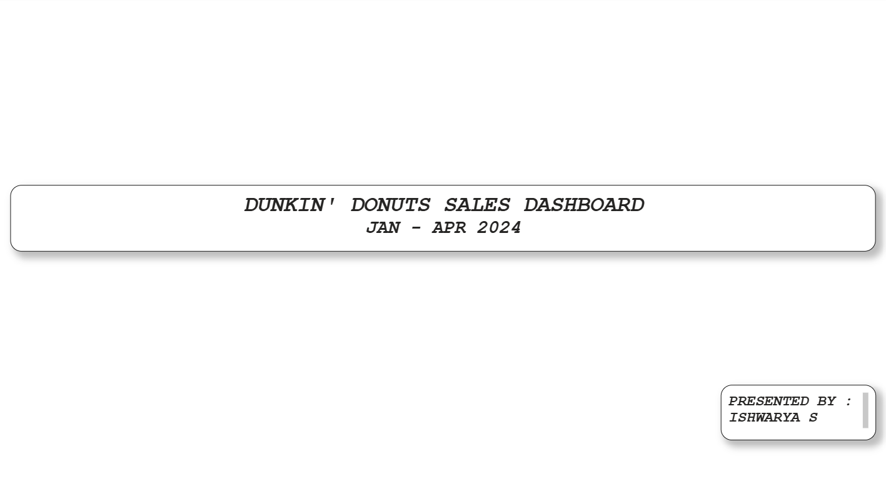
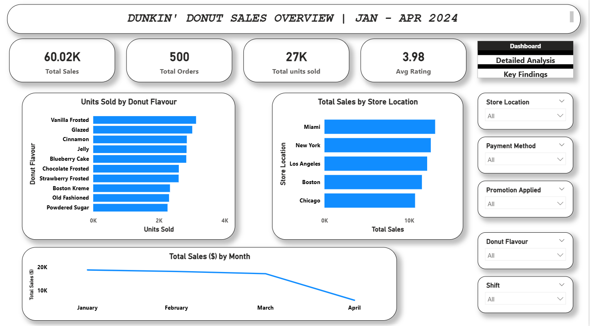
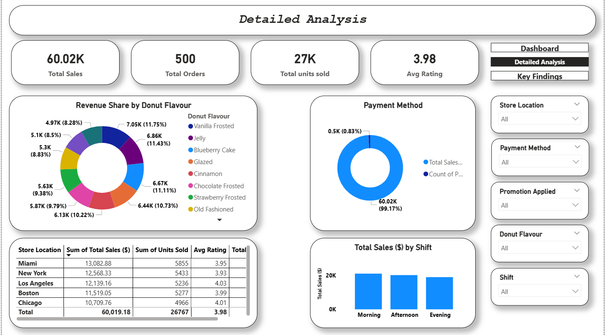
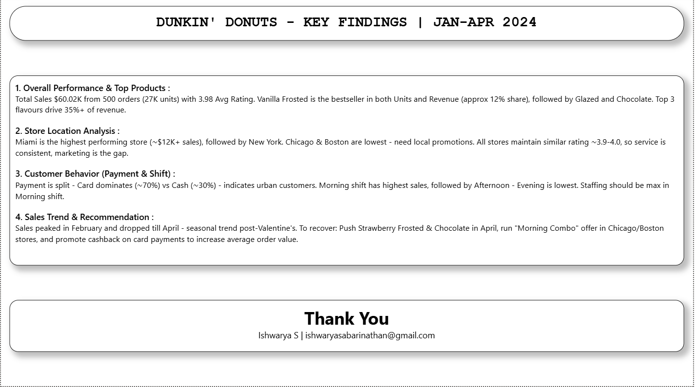

# DUNKIN' DONUTS SALES DASHBOARD

## 1. Front Page

## 2. Dashboard

## 3. Detailed Analysis

## 4. Key Findings

## Project Overview

An interactive Power BI sales dashboard analyzing Dunkin' Donuts sales performance from January to April 2024. The dashboard provides KPI tracking, product analysis, store comparison, sales trends, and interactive filtering.

## Tools Used

- **Power BI Desktop**
- **Power Query** -- Data cleaning and transformation
- **DAX** -- Measures and calculations

## Key KPIs

| Metric | Value |
|---|---:|
| Total Sales | **$60.02K** |
| Total Orders | **500** |
| Total Units Sold | **27K** |
| Average Rating | **3.98** |

## Dashboard Pages

### 1. Dashboard

- Units Sold by Donut Flavour
- Total Sales by Store Location
- Monthly Sales Trend
- KPI Cards
- Interactive Slicers

### 2. Detailed Analysis

- Revenue Share by Donut Flavour
- Payment Method Analysis
- Store-Level Performance Table
- Sales by Shift
- Interactive Slicers

### 3. Key Findings

- Overall sales and product performance
- Store location comparison
- Payment and shift analysis
- Monthly sales trend observations

## Key Insights

- Vanilla Frosted has the highest units sold among the displayed flavours.
- Miami has the highest sales among the five displayed locations.
- Chicago has the lowest sales among the displayed locations.
- Store ratings are relatively consistent, ranging from approximately 3.93 to 4.03.
- Morning records the highest sales among the three shifts.
- Sales show a significant decline in April compared with the earlier months.
- The top three flavours contribute approximately 34% of total revenue based on the displayed revenue-share chart.

## Skills Demonstrated

**Power BI | Data Cleaning | Power Query | DAX | Data Visualization | KPI Analysis | Business Insights | Dashboard Design**

## Prepared By

**Name:** Ishwarya S  
**Email:** ishwaryasabarinathan@gmail.com
