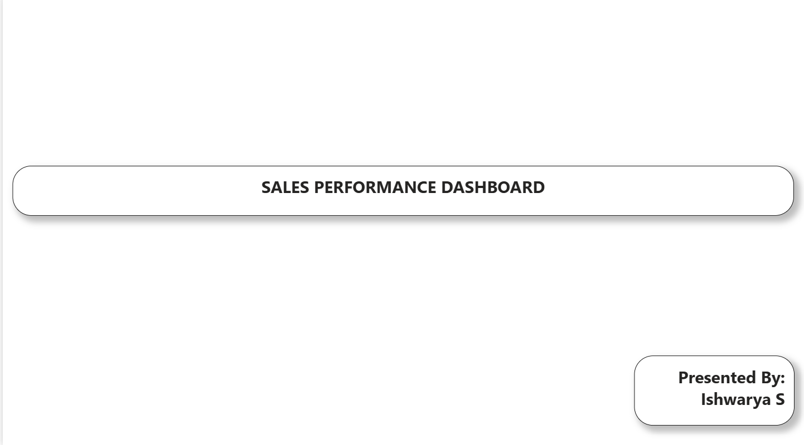
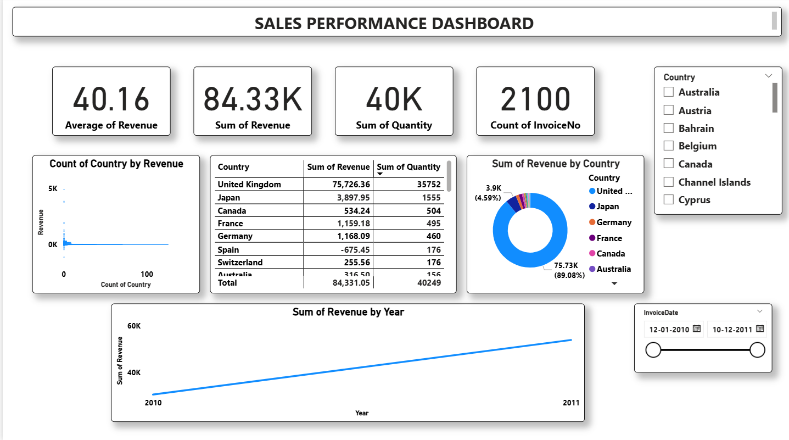
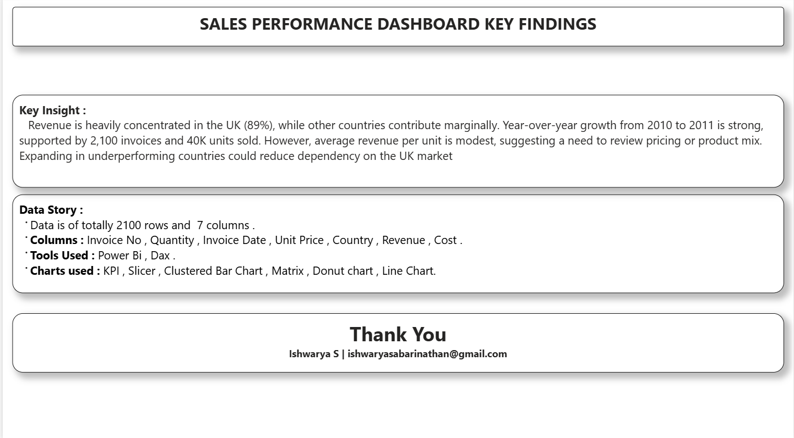

# ECOMMERCE SALES PERFORMANCE DASHBOARD

## 1. Front Page

## 2. Dashboard

## 3. Key Findings

## Project Overview
An interactive Power BI sales dashboard analyzing E-commerce sales from 2010 to 2011. The dashboard provides KPI tracking, country-wise performance, revenue trends, and interactive filtering.

## Tools Used
- **Power BI Desktop**
- **Power Query** - Data cleaning and transformation
- **DAX** - Measures and calculations

## Key KPIs

| Metric | Value |
|---|---:|
| Average of Revenue | **40.16** |
| Total Revenue | **84.33K** |
| Total Quantity | **40K** |
| Total Invoices | **2100** |

## Dashboard Pages

### 1. Dashboard
- Revenue by Country (Donut Chart)
- Country-wise Revenue & Quantity Table (Matrix)
- Revenue by Year (Line Chart)
- Country Revenue Distribution
- KPI Cards & Slicers (Country, InvoiceDate)

### 2. Key Findings
- Revenue concentration & growth analysis
- Pricing and market dependency insights

## Key Insights
- Revenue is heavily concentrated in the UK (89% - 75.73K), while other countries contribute marginally.
- Year-over-year growth from 2010 to 2011 is strong.
- Average revenue per unit is modest (40.16), suggesting a need to review pricing or product mix.
- Data contains 2100 rows and 7 columns: Invoice No, Quantity, Invoice Date, Unit Price, Country, Revenue, Cost.
- Expanding in underperforming countries could reduce dependency on the UK market.

## Skills Demonstrated
**Power BI | Data Cleaning | Power Query | DAX | Data Visualization | KPI Analysis | Matrix | Slicer | Donut & Line Chart**

## Prepared By

**Name:** Ishwarya S  
**Email:** ishwaryasabarinathan@gmail.com
