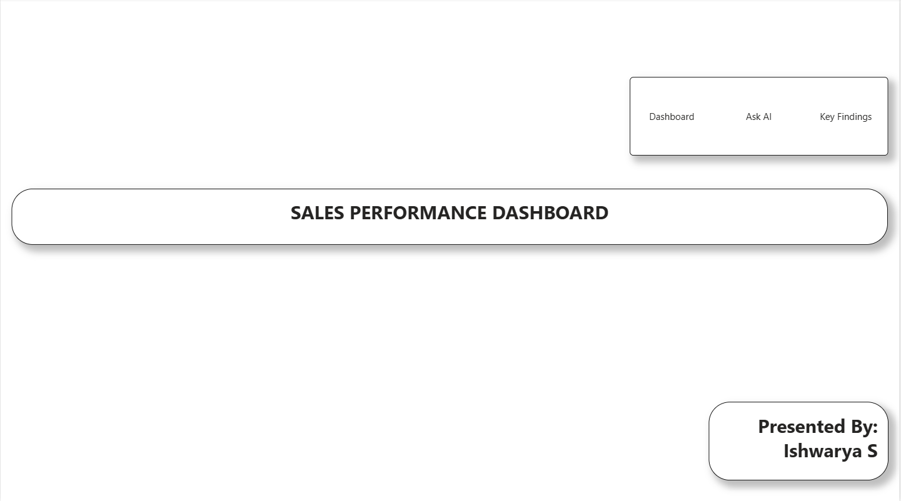
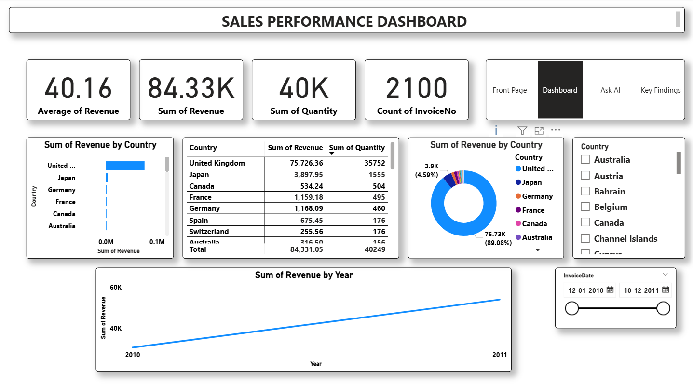
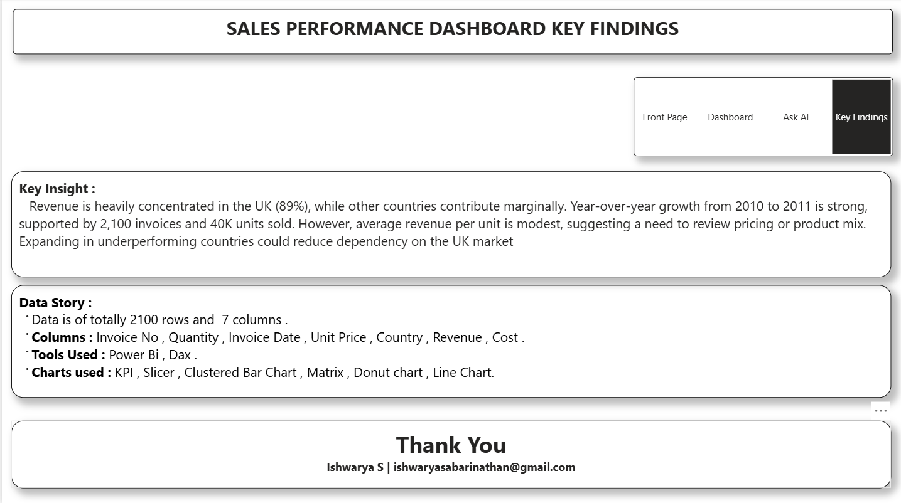

# 🛒 Ecommerce Sales Performance Dashboard | 2010-2011

An interactive Power BI dashboard analyzing 2100+ invoices and 40K units sold, focusing on revenue by country and YoY growth with Agentic AI.

**Presented By:** Ishwarya S | ishwaryasabarinathan@gmail.com

---

## 📊 Dashboard Preview

### 1️⃣ Front Page - Cover

### 2️⃣ Dashboard Overview - Sales Performance

**KPIs:**
- **Average of Revenue:** 40.16
- **Sum of Revenue:** 84.33K
- **Sum of Quantity:** 40K
- **Count of InvoiceNo:** 2100

**Visuals Covered:**
- Sum of Revenue by Country (Bar Chart) - UK Dominant
- Country-wise Matrix Table (UK: 75,726.36 | Japan: 3,897.95 | Canada: 534.24)
- Sum of Revenue by Country (Donut Chart - UK 89.98%)
- Sum of Revenue by Year (Line Chart - Growth from 2010 to 2011)
- Country Slicer & InvoiceDate Slicer

### 3️⃣ Ask AI - Agentic AI Insights

> **Try Asking:**
> "Show count of InvoiceNo" or
> "Which country has highest revenue" or
> "What is the sum of Revenue by Country?" or
> "Show sum of Quantity by Country?" or
> "What is sum of Revenue?" or
> "Show count of InvoiceNo by Country?"

Query: `Show count of InvoiceNo by country` - UK has ~1950+ invoices vs others <50.

### 4️⃣ Key Findings & Data Story

**Key Insight:**
Revenue is heavily concentrated in the UK (89%), while other countries contribute marginally. Year-over-year growth from 2010 to 2011 is strong, supported by 2,100 invoices and 40K units sold. However, average revenue per unit is modest, suggesting a need to review pricing or product mix. Expanding in underperforming countries could reduce dependency on the UK market.

**Data Story:**
- Data is of totally 2100 rows and 7 columns.
- Columns: Invoice No, Quantity, Invoice Date, Unit Price, Country, Revenue, Cost.
- Tools Used: Power BI, Dax.
- Charts used: KPI, Slicer, Clustered Bar Chart, Matrix, Donut chart, Line Chart.

---

## 💡 Recommendations
1. **Reduce UK Dependency:** UK is 89% revenue - expand marketing in Japan, Germany, France, Canada.
2. **Pricing Review:** Average revenue per unit is low (40.16) - need to review unit price or product mix.
3. **Growth Opportunity:** Strong YoY growth from 2010 to 2011 - continue momentum.

---

## 🛠️ Tools Used
- Power BI Desktop, Power Query, DAX
- Key Influencers & Decomposition Tree
- Q&A Visual (Agentic AI)

## 📂 Files in this Repo
- Screenshots (4 Pages)
- Ecommerce_Sample_100rows.xlsx
- Ecommerce_Sales_Dashboard.pdf
- Ecommerce.pbix

Thank You!
