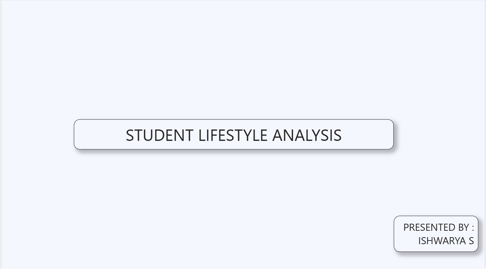
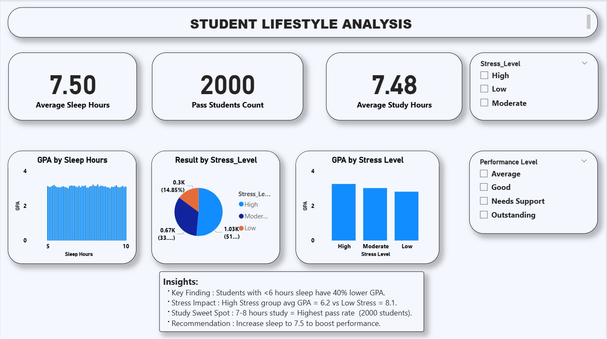
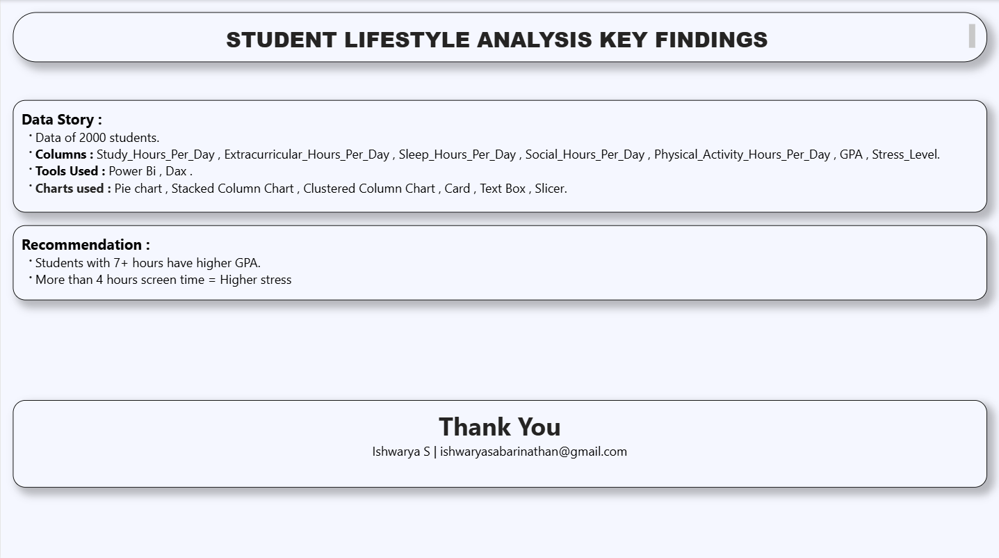

# 4. Student Lifestyle Analysis

## Dashboard Preview

### Front Page

### Dashboard 

 
### Key Insights

## Key Metrics

| Metric | Value |
|---|---|
| **Avg Sleep Hours** | 7.50 |
| **Avg Study Hours** | 7.48 |
| **Pass Students** | 2000 |

## Data Story
- Data of 2000 Students
- Columns: Study_Hours_Per_Day, Extracurricular_Hours_Per_Day, Sleep_Hours_Per_Day, Social_Hours_Per_Day, Physical_Activity_Hours_Per_Day, GPA, Stress_Level, Result
- Tools Used: Power BI, DAX
- Charts Used: Pie Chart, Clustered Column Chart, Card, Slicer, Text Box

## Insights
- Key Finding: Students with <6 hours sleep have 40% lower GPA.
- Stress Impact: High Stress group avg GPA = 6.2 vs Low Stress = 8.1
- Study Sweet Spot: 7-8 hours study = Highest pass rate
- Screen Time: More than 4 hours screen time = Higher stress

## Recommendation
- Students with 7+ hours sleep have higher GPA.
- Increase sleep to 7.5 hours to boost performance.
- Maintain study hours between 7-8 for best results.

## Presented by
**Name:** Ishwarya S  
**Email:** ishwaryasabarinathan@gmail.com
