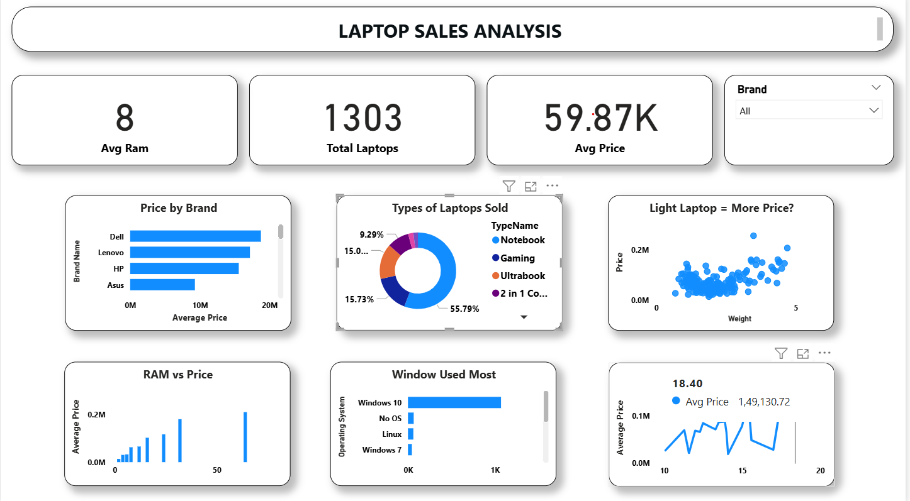
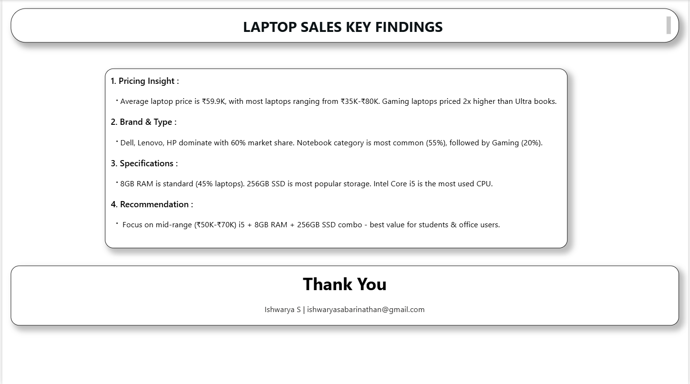

# LAPTOP SALES ANALYSIS

**Overview:** 
1303 Laptops Analysis | Avg Price 59.9K

**Findings:**
- Dell, Lenovo, HP = 60% Market Share
- Notebook 55% | Gaming 20%
- 8GB RAM (45%) + 256GB SSD Popular
- Gaming Laptops 2x Costly than Ultrabooks

**Tool:** 
- Power BI 

**Presented by**  
**Name:** Ishwarya S
**Email:** ishwaryasabarinathan@gmail.com
